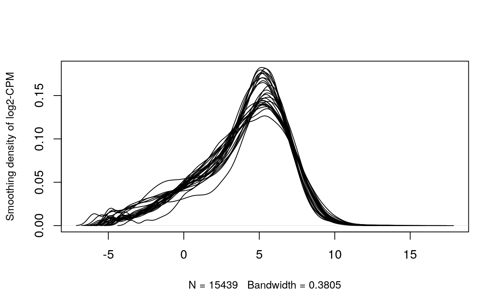

# Assignment 1 Recap
To recap, in Assignment 1, I (1) analysed information about the dataset I have chosen, and its associated publication, (2) mapped the expression data to HUGO gene symbols, (3) filtered out unncecessary genes, and (4) normalized the dataset. The following subsections go over these points in a bit more detail, and are taken from my Assignment 1. In addition, the code from my .rmd file includes code from A1- in order to regenerate the normalized counts matrix. 

### Brief Introduction to the Data
The expression dataset that I had chosen is [GSE221253](https://www.ncbi.nlm.nih.gov/geo/query/acc.cgi?acc=GSE221253), taken from the GEO expression data repository. The study associated with this dataset involved adoptive cell therapy. Adoptive cell therapy via tumor infiltrating lymphocytes (ACT-TIL) is a type of immunotherapy used to treat cancer. This [study](https://www.science.org/doi/10.1126/sciimmunol.adg7995) took samples from 13 patients having metastatic melanoma and performed RNAseq analysis, along with other analyses like spatial proteomics and scRNAseq, on tumor tissues before and after the cell therapy (pre- and post-ACT) in order to gain a better understanding of the interactions and cell states within the tumor microenvironment throughout treatment. For the RNAseq experiment, this resulted in a total of 26 samples, and 13 in each condition (two for each patient, and the experimental conditions being pre- and post-ACT treatment). 

### Mapping to HUGO Gene Symbols
The first step from Assignment 1 was to map the expression data to HUGO gene symbols. Only 940 out of 19117 genes from our original gene expression raw file were unable to be mapped to HUGO gene symbols. This is actually not that bad! 

### Dataset Filteration and Normalization 
The next step in Assignment 1 was to filter out the genes with low counts and normalize our data. Filteration of outlier genes with low gene counts removed ~3678 genes from the expression dataset. Then, TMM normalization was performed to normalize the data. The plots (pre and post normalization + filtration) are shown below: 




# Differential Gene Expression

The first step of Assignment 2 is to perform differential gene expression, to identify key genes that are differentially expressed between our subgroups. This involves (1) constructing our model design, (2) estimating the dispersion, (3) performing multiple hypothesis testing and using the Quasi liklihood model to calculate differential expression, and (4) generate a heatmap and MA plot of the data. 
```{r, message=FALSE, echo=FALSE, warning=FALSE, error=FALSE, include=FALSE}
#do all of the A1 preprocessing stuff here
#install BiocManager package 
if (!requireNamespace("BiocManager", quietly = TRUE))
    install.packages("BiocManager")

#install GEOquery
if (!requireNamespace("GEOquery", quietly = TRUE))
    BiocManager::install("GEOquery")

#install knitr
if (!requireNamespace("knitr", quietly = TRUE))
    install.packages("knitr")

#install edgeR
if (!requireNamespace("edgeR", quietly = TRUE))
    BiocManager::install("edgeR")

#install limma 
if (!requireNamespace("limma", quietly = TRUE))
    BiocManager::install("limma")

#install ComplexHeatmap
if (!require("ComplexHeatmap", quietly = TRUE)) {
  # If not installed, install the package
  install.packages("ComplexHeatmap")
}

#install colorRamp2
if (!require("colorRamp2", quietly = TRUE)) {
  # If not installed, install the package
  install.packages("colorRamp2")
}

#install gprofiler2
if (!require("gprofiler2", quietly = TRUE)) {
  # If not installed, install the package
  install.packages("gprofiler2")
}

#install GSA
if (!require("GSA", quietly = TRUE)) {
  # If not installed, install the package
  install.packages("GSA")
}

#load up all of the libraries
library(GEOquery)
library(knitr)
library(biomaRt)
library(edgeR)
library(limma)
library(colorRamp2)
library(ComplexHeatmap)

#assign the dataset accession number to a variable for easy access. 
dataSetId <- "GSE221253"

#get dataset information from GEO, and display just the GEO description of the dataset. 
dataInfo <- getGEO(dataSetId, GSEMatrix = FALSE)
# Consolidation of sample information
sampleList <- dataInfo@gsms

samplesInfo <- do.call(rbind,
                        lapply(sampleList, 
                               FUN=function(x){
                                 c(x@header$title, 
                                   x@header$characteristics_ch1[1],
                                   x@header$characteristics_ch1[3])
                               }))

#Neatly format above data. 
colnames(samplesInfo) <- c("title", "tissue", "time")
samplesInfo[,'tissue'] <- gsub(samplesInfo[,'tissue'],
                                pattern = "tissue: ", 
                                replacement = "")
samplesInfo[,'time'] <- gsub(samplesInfo[,'time'],
                                pattern = "time: ", 
                                replacement = "")

samplesInfoMatrix <- as.data.frame(samplesInfo)

normalized_counts <- read.delim("normalized_baseline_vs_TIL_counts.txt")


normalized_counts_matrix <- data.matrix(normalized_counts)

#code for MDS plot
dot <- c( "post-ACT", "pre-ACT", "post-ACT", "pre-ACT", "post-ACT", "pre-ACT", "post-ACT", "pre-ACT", "post-ACT", "pre-ACT", "post-ACT", "pre-ACT", "post-ACT", "pre-ACT", "post-ACT", "pre-ACT", "post-ACT", "pre-ACT", "pre-ACT", "post-ACT", "post-ACT", "pre-ACT", "pre-ACT", "pre-ACT", "pre-ACT")
dotColor <- c("lightblue", "orange", "lightblue", "orange", "lightblue", "orange", "lightblue", "orange", "lightblue", "orange", "lightblue", "orange", "lightblue", "orange", "lightblue", "orange", "lightblue", "orange","orange", "lightblue", "lightblue", "orange","orange", "orange","orange")

dotShape <- c(15, 16, 15, 16, 15, 16, 15, 16, 15, 16, 15, 16, 15, 16, 15, 16, 15, 16, 16, 15, 15, 16, 16, 16, 16)

```

### Model Design

After inspection of the MDS plot (below), it doesn't seem that there is a lot of clustering amongst pre-ACT and post-ACT samples. However, since the study associated with this data set aims to understand interactions and cell states within the tumor microenvironment throughout treatment, it makes the most sense to define the group for our model design, as the time of treatment (pre-ACT or post-ACT), as opposed to tumor type (since all samples are from the same tumor), or patient. So, I decided to make my model design based off of the time point the samples were collected (before ACT treatment and after ACT treatment). Here, we also define the DGEList. 

```{r, , message=FALSE, echo=FALSE, warning=FALSE, error=FALSE}

limma::plotMDS(log2(normalized_counts), col=dotColor, pch=dotShape)
legend("topright", col=c("lightblue", "orange"), pch=c(15,16), legend=c("post-ACT", "pre-ACT"))
```

```{r, , message=FALSE, echo=FALSE, warning=FALSE, error=FALSE}

#construct DGEList object
dgeobj = DGEList(counts=normalized_counts_matrix, group=samplesInfoMatrix$time)

model_design <- model.matrix(~samplesInfoMatrix$time)
print(model_design)
```

### Estimate Dispersion + Top Gene Hits

Here, we estimate the dispersion, fit the model to our specified model design, and then calculate differential expression using the Quasi liklihood model. The table below shows the top gene hits.  
```{r, message=FALSE, echo=FALSE, warning=FALSE, error=FALSE}

dgeobj <- estimateDisp(dgeobj, model_design)
fit <- glmQLFit(dgeobj, model_design)

qlf.pre_vs_post <- glmQLFTest(fit,
coef='samplesInfoMatrix$timepre-ACT')
kable(topTags(qlf.pre_vs_post), type="html",row.names =
TRUE)
```


### Multiple Hypothesis Testing

In the below code blocks, we compile all of the results, and find how many genes pass the threshold value, and how many genes pass correction. 
```{r, message=FALSE, echo=FALSE, warning=FALSE, error=FALSE}

qlf_output_hits <- topTags(qlf.pre_vs_post, sort.by = "PValue", n = nrow(normalized_counts_matrix))
```

How many genes pass the p-value threshold p < 0.05? 
```{r, message=FALSE, echo=FALSE, warning=FALSE, error=FALSE}

length(which(qlf_output_hits$table$PValue < 0.05))
```
Now, let us see how many genes pass correction for multiple hypothesis testing. ~25% of the genes pass correction. This is a decent number, as it is not too much or not too little genes.  
```{r, message=FALSE, echo=FALSE, warning=FALSE, error=FALSE}

length(which(qlf_output_hits$table$FDR < 0.05))
```

### MA Plot
Here is an MA plot that displays the differential gene expression between our two groups of samples: pre- and post- ACT.

```{r, message=FALSE, echo=FALSE, warning=FALSE, error=FALSE}

# Extract FDR values 
FDR <- qlf_output_hits$table$FDR

plot(qlf_output_hits$table$logCPM, qlf_output_hits$table$logFC, main="MA plot", xlab="AvglogCPM", ylab="logFC")

downregulated <- FDR < 0.05 & qlf_output_hits$table$logFC < -0.25
upregulated <- FDR < 0.05 & qlf_output_hits$table$logFC > 0.25

points(qlf_output_hits$table$logCPM[downregulated], qlf_output_hits$table$logFC[downregulated], col="tomato")

points(qlf_output_hits$table$logCPM[upregulated], qlf_output_hits$table$logFC[upregulated], col="lightblue")

abline(h=0, col="green")

legend("topright", legend=c("Downregulated", "Upregulated"), col=c("tomato", "lightblue"), pch=16)
```

### Heat Map
The following codeblock generates a heatmap of our data, along with annotations, to see how the data seems to cluster. Based on what is shown in the heatmap below, there does seem to be some minimal clustering of genes that are overexpressed in some pre-ACT samples. 
```{r, message=FALSE, echo=FALSE, warning=FALSE, error=FALSE}


top_hits_pre_post <- rownames(qlf_output_hits$table)[qlf_output_hits$table$PValue<0.05]
heatmap_tophits <- t(scale(t(normalized_counts_matrix[which(rownames(normalized_counts_matrix) %in% top_hits_pre_post),])))
if(min(heatmap_tophits) == 0){
    heatmap_col = colorRamp2(c( 0, max(heatmap_tophits)), c( "white", "red"))
  } else {
    heatmap_col = colorRamp2(c(min(heatmap_tophits), 0,
                      max(heatmap_tophits)),
                      c("blue", "white", "red"))
  }

#let us add some annotations to the heatmap and cluster according to the time- pre- and post-ACT. 
unique_time <- unique(samplesInfoMatrix$time)
unique_timescolors <- rainbow(n = length(unique_time))
names(unique_timescolors) <- unique_time

ha_pat <- HeatmapAnnotation(df = data.frame(times = samplesInfoMatrix$time), col = list(patients =
unique_timescolors), show_legend = TRUE)
current_heatmap <- Heatmap(heatmap_tophits,
                           top_annotation = ha_pat,
                           cluster_rows = TRUE,
                           cluster_columns = TRUE,
                           show_row_dend = TRUE,
                           show_column_dend = TRUE,
                           col=heatmap_col,
                           show_column_names = FALSE,
                           show_row_names = FALSE,
                           show_heatmap_legend = TRUE,
                           )

current_heatmap
```


# Thresholded Over Representation Analysis
The last step of this assignment is to perform thresholded over-representation analysis (ORA). Essentially, our main goal here is to see whether our upregulated or downregulated genes all share some kind of common characteristic (maybe some of them are from the same pathway, etc). By doing this, we can then make conclusions about what kind of genes are overexpressed/underexpressed and ensure that it aligns with literature.


### Define All, Upregulated, Downregulated genes
Here, we define our upregulated and downregulated genes. Upregulated genes are defined here to have a p-value of 0.05 and positive fold change. Downregulated genes are defined here to have a p-value of 0.05 and negative fold change. We also print 
```{r, message=FALSE, echo=FALSE, warning=FALSE, error=FALSE}

#Here, we define all of the genes
upregulatedGenes <- rownames(qlf_output_hits$table)[qlf_output_hits$table$FDR < 0.05 & qlf_output_hits$table$logFC > 0]
downregulatedGenes <- rownames(qlf_output_hits$table)[qlf_output_hits$table$FDR < 0.05 & qlf_output_hits$table$logFC < 0]
allSignificantGenes <- rownames(qlf_output_hits$table)[qlf_output_hits$table$FDR < 0.05]

print("Number of upregulated genes")
length(upregulatedGenes)

print("Number of downregulated genes")
length(downregulatedGenes)

print("Number of significant genes in total")
length(allSignificantGenes)

```

### Running G:profiler on All Significant Genes
Here, we run run g:profiler on the set of all significant genes that have a p-value of < 0.05 to perform a gene set enrichment analysis.
```{r, message=FALSE, echo=FALSE, warning=FALSE, error=FALSE}

gprofiler_results_all <- gost(query = allSignificantGenes,
                          organism = "hsapiens",
                          significant=FALSE,
                          exclude_iea=TRUE,
                          correction_method = "fdr",
                          sources = c("REAC","WP","GO:BP"))


allSignificant_results <- gprofiler_results_all$result

knitr::kable(
  head(allSignificant_results), type = "html", digits = 40, row.names = FALSE)


```


### Running G:profiler on the Upregulated Gene Set 
In the codeblock below, we run g:profiler on the set of upregulated genes to perform a gene set enrichment analysis. 
```{r, message=FALSE, echo=FALSE, warning=FALSE, error=FALSE}

gprofiler_results_upregulated <- gost(query = upregulatedGenes,
                          organism = "hsapiens",
                          significant=FALSE,
                          exclude_iea=TRUE,
                          correction_method = "fdr",
                          sources = c("REAC","WP","GO:BP"))


upregulated_results <- gprofiler_results_upregulated$result

knitr::kable(
  head(upregulated_results, n=20), type = "html", digits = 40, row.names = FALSE)

```


### Running G:profiler on the Downregulated Gene Set
Here, we do the same for the set of downregulated genes, and perform a gene set enrichment analysis on them. 
```{r, message=FALSE, echo=FALSE, warning=FALSE, error=FALSE}

gprofiler_results_downregulated <- gost(query = downregulatedGenes,
                          organism = "hsapiens",
                          significant=FALSE,
                          exclude_iea=TRUE,
                          correction_method = "fdr",
                          sources = c("REAC","WP","GO:BP"))


downregulated_results <- gprofiler_results_downregulated$result


knitr::kable(
  head(downregulated_results), type = "html", digits = 40, row.names = FALSE)


```


### Gene Sets Returned from Downregulated and Upregulated Analyses
Here, we present the number of gene sets returned from both the downregulated and upregulated analyses: 
```{r, message=FALSE, echo=FALSE, warning=FALSE, error=FALSE}

print("How many genesets were returned from downregulated analysis?")
nrow(downregulated_results)

print("How many genesets were returned from upregulated analysis")
nrow(upregulated_results)


```


# Interpretation

**1. Do the over-representation results support conclusions or mechanism discussed in the original paper?**
The authors in the original paper concluded that in samples after Adoptive Cell Therapy,
there was an increase in the strength and number of tumor infiltrating lymphocytes
(TILSs), as well as an increase in interferon-activated myeloid T-cells (Barras 2024). 
This suggests that there seems to be an overall improved immune response towards 
the tumor after cell therapy. Upon looking at the over-representation results for
down-regulated and up-regulated genes, however, there does not seem to be much 
correlation between the papers findings and the over-representation results. 
The overrepresentation results list common metabolic process such as "small 
molecule metabolic process" and "mitochondrial ATP synthesis coupled electron 
transport" as top hits, but these are not indicative of anything as they are 
very general/broad processes. 

**2. Can you find evidence, i.e. publications, to support some of the results that you see. How does this evidence support your results**
I was unfortunately not able to fund any publications to support the results that 
I see. However, one of the terms from the overrepresentation results list for 
upregulation is "intrinsic apoptotic signaling pathway by p53 class mediator". 
This likely indicates that in post-ACT samples, the p53 protein potentially had 
increased activity in inducing apoptosis in tumor cells, somewhat supporting the 
original papers results (which suggests that there seems to be an overall improved 
immune response after cell therapy). One [paper](https://www.ncbi.nlm.nih.gov/pmc/articles/PMC8558413/#:~:text=p53%20influences%20the%20innate%20immune,cells%2C%20resulting%20in%20immune%20evasion.)in particular, mentions p53s role in supressing tumor cell growth (tumorgenesis). 


# Assignment Questions

### Differential Gene Expression

**1 Calculate p-values for each of the genes in your expression set. How many genes were significantly differentially expressed? What thresholds did you use and why?**
P-values are calculated in the "Estimate Dispersion + Top Gene Hits" section. A 
total of 4684 genes were significantly differentially expressed when using a 
threshold of p-value < 0.05. I decided to use a p-value threshold of 0.05 because 
it is the standard threshold used across literature. I did not want to be too 
strict and lower it either, nor did I increase this threshold. Code that generated 
all these results should be in the above code blocks. 

**2. Multiple hypothesis testing - correct your p-values using a multiple hypothesis correction method. Which method did you use? And Why? How many genes passed correction?**
Corrected p-values are shown in the "Multiple Hypothesis Testing" section of this 
assignment. I used the FDR correction method, as it is not too conservative, but 
still corrects well enough for multiple hypothesis testing. I did not use the 
Bonferroni test on the other hand, as it is a bit too conservative. 1643 genes 
passed multiple hypothesis testing correction. 

**3. Show the amount of differentially expressed genes using an MA Plot or a Volcano plot. Highlight genes of interest.** 
MA plot is presented in above code blocks. 

**4. Visualize your top hits using a heatmap. Do you conditions cluster together? Explain why or why not.** 
Heatmap of the differential expression results are presented in the above code blocks.
Upon closer inspection after annotating the heatmap according to time of treatment, 
there does seem to be some minimal clustering of conditions. For instance, some genes 
in pre-ACT samples (in the left of the heatmap) seem to have increased expression than 
in post-ACT samples (in the right of the heatmap). 

### Thresholded over-representation analysis

**1. Which method did you choose and why?**
I decided to choose the thresholding list method as opposed to the non-thresholding 
method, since it is relatively quick, and has a lot of tools readily available for it. 

**2. What annotation data did you use and why? What version of the annotation are you using?**
For my annotation data, I used REAC (the reactome pathway database),WP (Wiki Pathways),
and GO:BP (Gene Ontology- Biological Process). I decided to use these annotation sources
because they are very comprehensive, and used heavily in existing literature, so they
are considered reliable. 

**3. How many genesets were returned with what thresholds?** 
[Gene Sets Returned from Downregulated and Upregulated Analyses]

**4. Run the analysis using the up-regulated set of genes, and the down-regulated set of genes separately. How do these results compare to using the whole list (i.e all differentially expressed genes together vs. the up-regulated and down regulated differentially expressed genes separately)?** 
[Running G:profiler on All Significant Genes] [Running G:profiler on the Upregulated Gene Set] 
[Running G:profiler on the Downregulated Gene Set] The top term for the whole 
list and the top term for the down-regulated set of genes are the same- "small 
molecule metabolic process". However, the top term for the up-regulated set of 
genes is "mitochondrial ATP synthesis coupled electron transport". This suggests
that there is stronger differential expression in genes that are down-regulated 
as opposed to up-regulated. 


# References

  Morgan M, Ramos M (2023). _BiocManager: Access the Bioconductor Project Package
      Repository_. R package version 1.30.22,
      <https://CRAN.R-project.org/package=BiocManager>.
      
  Davis, S. and Meltzer, P. S. GEOquery: a bridge between the Gene Expression
      Omnibus (GEO) and BioConductor. Bioinformatics, 2007, 14, 1846-1847
      
  Xie Y (2023). _knitr: A General-Purpose Package for Dynamic Report Generation in
      R_. R package version 1.45, <https://yihui.org/knitr/>.
      
  Robinson MD, McCarthy DJ and Smyth GK (2010). edgeR: a Bioconductor package for
      differential expression analysis of digital gene expression data. Bioinformatics
      26, 139-140
      
  Response to tumor-infiltrating lymphocyte adoptive therapy is associated with preexisting 
     CD8+ T-myeloid cell ... (n.d.). <https://www.science.org/doi/10.1126/sciimmunol.adg7995>
     
     
  Gu Z, Eils R, Schlesner M (2016). “Complex heatmaps reveal patterns and correlations 
     in multidimensional genomic data.” Bioinformatics. doi:10.1093/bioinformatics/btw313

  Gu Z (2022). “Complex Heatmap Visualization.” iMeta. doi:10.1002/imt2.43.
  
  Kolberg L, Raudvere U, Kuzmin I, Vilo J, Peterson H (2020). “gprofiler2– an R 
     package for gene list functional enrichment analysis and namespace conversion toolset  
     g:Profiler.” F1000Research, 9 (ELIXIR)(709). R package version 0.2.3.
     
  Seidel, C. S. C. (n.d.). Intro to Edger. https://research.stowers.org/cws/CompGenomics/Projects/edgeR.html 
  
  Shi D, Jiang P. A Different Facet of p53 Function: Regulation of Immunity and 
     Inflammation During Tumor Development. Front Cell Dev Biol. 2021 Oct 18;9:762651. 
     doi:10.3389/fcell.2021.762651. PMID: 34733856; PMCID: PMC8558413.
     
  Agrawal a, et al. (2024) WikiPathways 2024: next generation pathway database. NAR. 
  
  Milacic M, Beavers D, Conley P, Gong C, Gillespie M, Griss J, Haw R, Jassal B,
     Matthews L, May B, Petryszak R, Ragueneau E, Rothfels K, Sevilla C, Shamovsky V, 
     Stephan R, Tiwari K, Varusai T, Weiser J, Wright A, Wu G, Stein L, Hermjakob H, 
     D’Eustachio P. The Reactome Pathway Knowledgebase 2024. Nucleic Acids Research. 
     2024. doi: 10.1093/nar/gkad1025. 
     
  Ashburner et al. Gene ontology: tool for the unification of biology. Nat Genet. 
     2000 May;25(1):25-9. DOI: 10.1038/75556 
     

