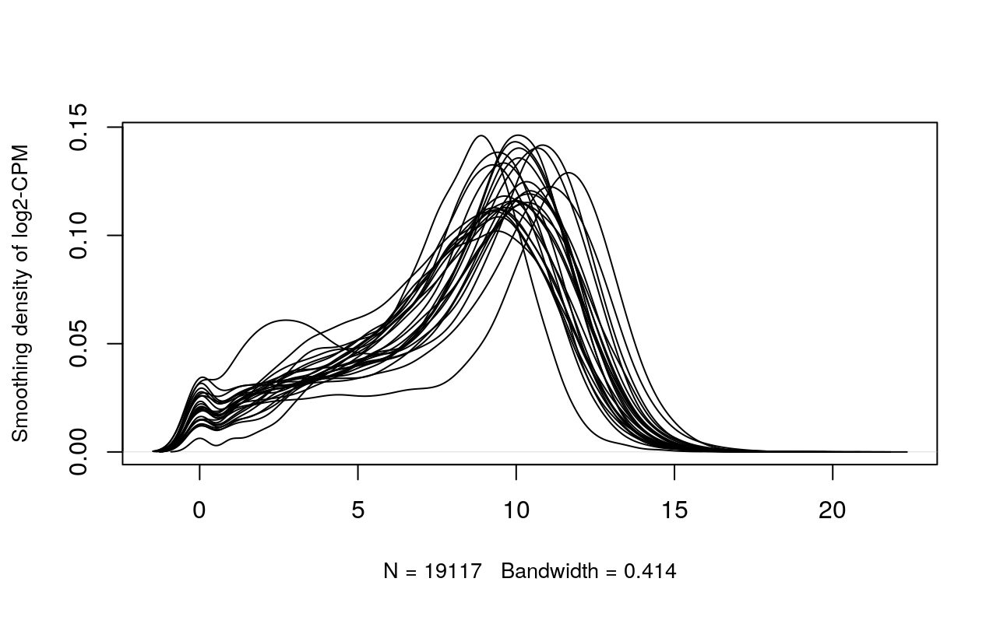
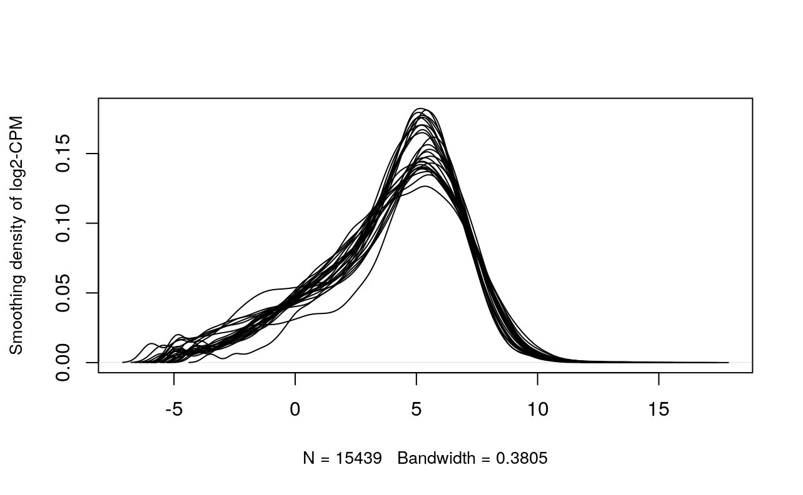
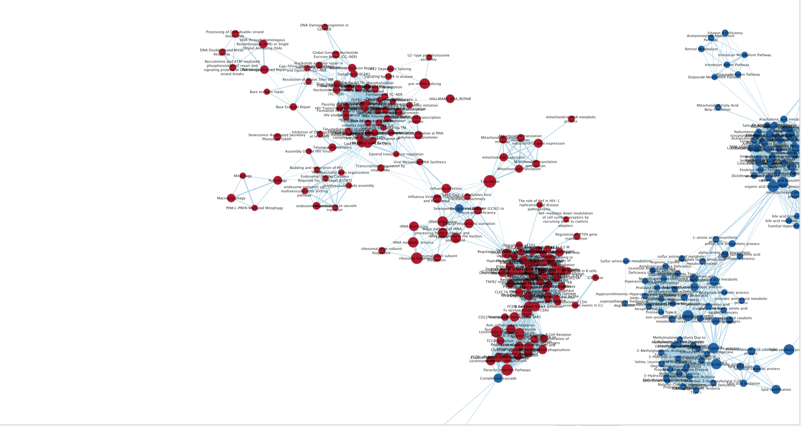
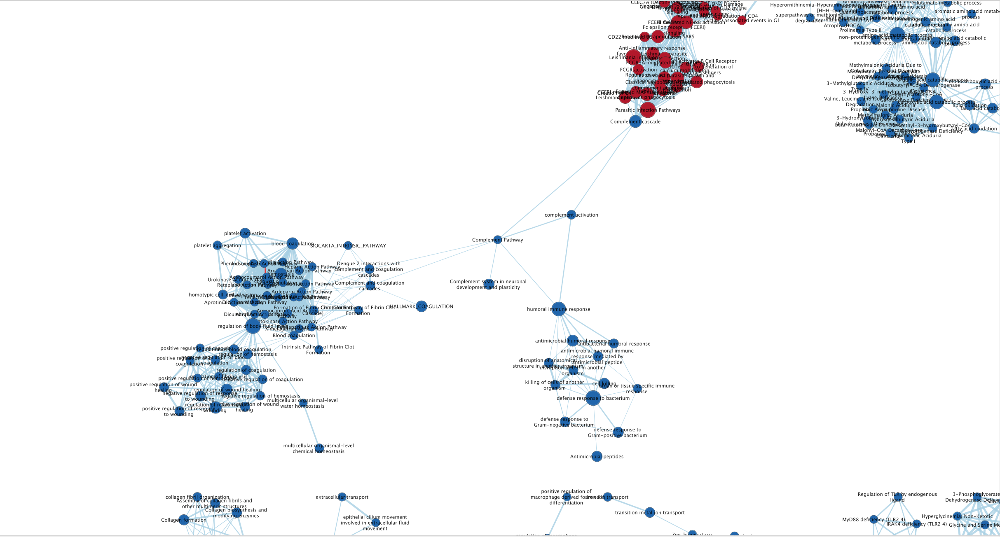
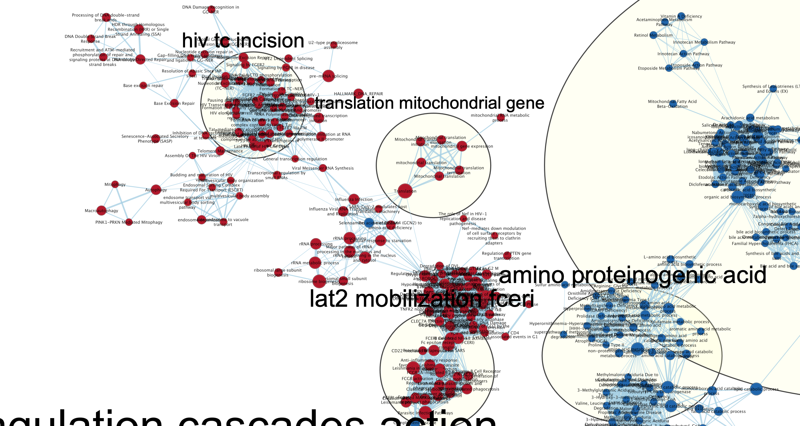
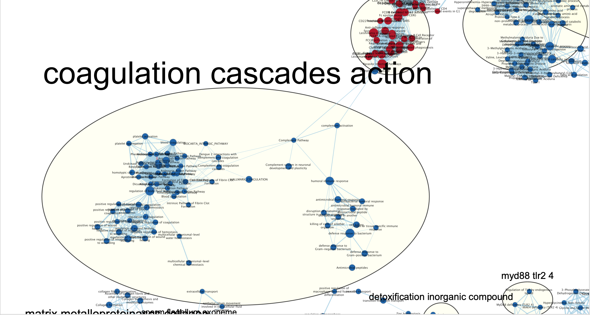
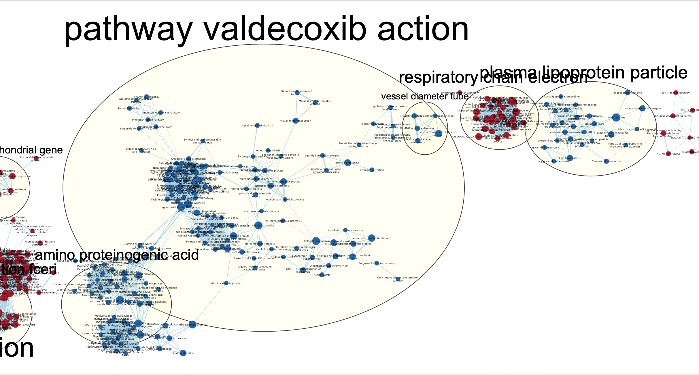
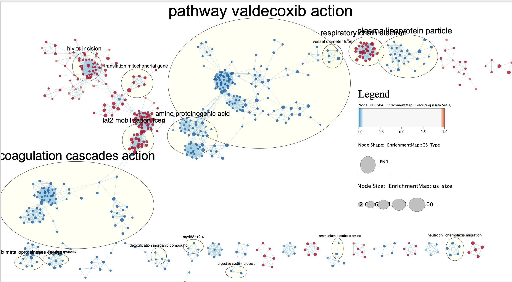
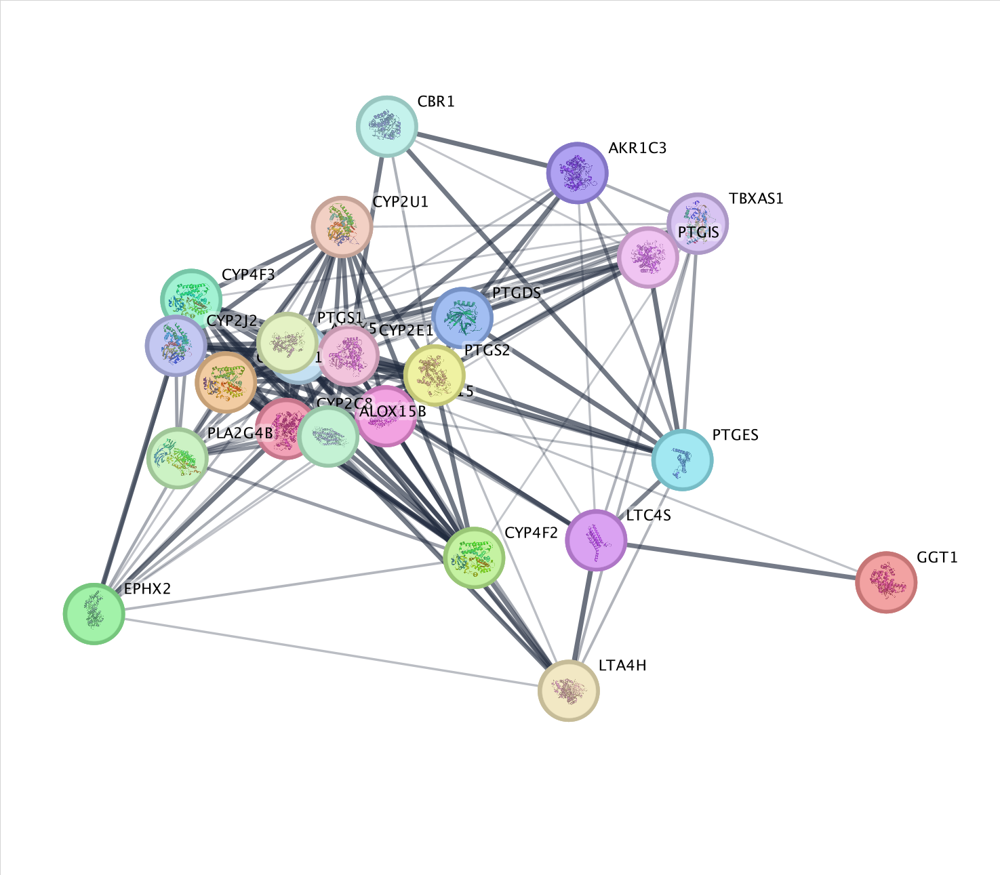

# Assignment 1 Recap
To recap, in Assignment 1, I (1) analysed information about the dataset I have 
chosen, and its associated publication, (2) mapped the expression data to HUGO 
gene symbols, (3) filtered out unncecessary genes, and (4) normalized the dataset. 
The following subsections go over these points in a bit more detail, and are taken 
from my Assignment 1. In addition, the code from my .rmd file includes code from 
A1- in order to regenerate the normalized counts matrix. 

## Brief Introduction to the Data
The expression dataset that I had chosen is [GSE221253](https://www.ncbi.nlm.nih.gov/geo/query/acc.cgi?acc=GSE221253), 
taken from the GEO expression data repository. The study associated with this 
dataset involved adoptive cell therapy. Adoptive cell therapy via tumor infiltrating 
lymphocytes (ACT-TIL) is a type of immunotherapy used to treat cancer. 
This [study](https://www.science.org/doi/10.1126/sciimmunol.adg7995) took samples 
from 13 patients having metastatic melanoma and performed RNAseq analysis, along
with other analyses like spatial proteomics and scRNAseq, on tumor tissues before 
and after the cell therapy (pre- and post-ACT) in order to gain a better understanding 
of the interactions and cell states within the tumor microenvironment throughout 
treatment. For the RNAseq experiment, this resulted in a total of 26 samples, and 
13 in each condition (two for each patient, and the experimental conditions being 
pre- and post-ACT treatment). 

## Mapping to HUGO Gene Symbols
The first step from Assignment 1 was to map the expression data to HUGO gene 
symbols. Only 940 out of 19117 genes from our original gene expression raw file 
were unable to be mapped to HUGO gene symbols. This is actually not that bad! 

## Dataset Filteration and Normalization 
The next step in Assignment 1 was to filter out the genes with low counts and 
normalize our data. Filteration of outlier genes with low gene counts removed 
~3678 genes from the expression dataset. Then, TMM normalization was performed 
to normalize the data. The plots (pre and post normalization + filtration) are 
shown below:






# Assignment 2 Recap
To recap, the first step of Assignment 2 is to perform differential gene expression,
in order to identify key genes that are differentially expressed between our subgroups. 
This involves (1) constructing our model design, (2) estimating the dispersion, (3) 
performing multiple hypothesis testing and using the Quasi likelihood model to 
calculate differential expression, and (4) generate a heatmap and MA plot of the data. 
Next, we performed threshold over-representation analysis
```{r, message=FALSE, echo=FALSE, warning=FALSE, error=FALSE, include=FALSE}
#do all of the A1 preprocessing stuff here
#install BiocManager package 
if (!requireNamespace("BiocManager", quietly = TRUE))
    install.packages("BiocManager")

#install GEOquery
if (!requireNamespace("GEOquery", quietly = TRUE))
    BiocManager::install("GEOquery")

#install knitr
if (!requireNamespace("knitr", quietly = TRUE))
    install.packages("knitr")

#install edgeR
if (!requireNamespace("edgeR", quietly = TRUE))
    BiocManager::install("edgeR")

#install limma 
if (!requireNamespace("limma", quietly = TRUE))
    BiocManager::install("limma")

#install ComplexHeatmap
if (!require("ComplexHeatmap", quietly = TRUE)) {
  # If not installed, install the package
  install.packages("ComplexHeatmap")
}

#install colorRamp2
if (!require("colorRamp2", quietly = TRUE)) {
  # If not installed, install the package
  install.packages("colorRamp2")
}

#install gprofiler2
if (!require("gprofiler2", quietly = TRUE)) {
  # If not installed, install the package
  install.packages("gprofiler2")
}

#install GSA
if (!require("GSA", quietly = TRUE)) {
  # If not installed, install the package
  install.packages("GSA")
}

if (!require("devtools", quietly = TRUE)) {
  # If not installed, install the package
  install.packages("devtools")
}

#install required R and bioconductor packages
tryCatch(expr = { library("RCurl")}, 
         error = function(e) {  
           install.packages("RCurl")}, 
         finally = library("RCurl"))

library(devtools)

#load up all of the libraries
library(GEOquery)
library(knitr)
library(biomaRt)
library(edgeR)
library(limma)
library(colorRamp2)
library(ComplexHeatmap)
library(data.table)
library(ggplot2)

#assign the dataset accession number to a variable for easy access. 
dataSetId <- "GSE221253"

#get dataset information from GEO, and display just the GEO description of the dataset. 
dataInfo <- getGEO(dataSetId, GSEMatrix = FALSE)
# Consolidation of sample information
sampleList <- dataInfo@gsms

samplesInfo <- do.call(rbind,
                        lapply(sampleList, 
                               FUN=function(x){
                                 c(x@header$title, 
                                   x@header$characteristics_ch1[1],
                                   x@header$characteristics_ch1[3])
                               }))

#Neatly format above data. 
colnames(samplesInfo) <- c("title", "tissue", "time")
samplesInfo[,'tissue'] <- gsub(samplesInfo[,'tissue'],
                                pattern = "tissue: ", 
                                replacement = "")
samplesInfo[,'time'] <- gsub(samplesInfo[,'time'],
                                pattern = "time: ", 
                                replacement = "")

samplesInfoMatrix <- as.data.frame(samplesInfo)

normalized_counts <- read.delim("normalized_baseline_vs_TIL_counts.txt")


normalized_counts_matrix <- data.matrix(normalized_counts)

#code for MDS plot
dot <- c( "post-ACT", "pre-ACT", "post-ACT", "pre-ACT", "post-ACT", "pre-ACT", "post-ACT", "pre-ACT", "post-ACT", "pre-ACT", "post-ACT", "pre-ACT", "post-ACT", "pre-ACT", "post-ACT", "pre-ACT", "post-ACT", "pre-ACT", "pre-ACT", "post-ACT", "post-ACT", "pre-ACT", "pre-ACT", "pre-ACT", "pre-ACT")
dotColor <- c("lightblue", "orange", "lightblue", "orange", "lightblue", "orange", "lightblue", "orange", "lightblue", "orange", "lightblue", "orange", "lightblue", "orange", "lightblue", "orange", "lightblue", "orange","orange", "lightblue", "lightblue", "orange","orange", "orange","orange")

dotShape <- c(15, 16, 15, 16, 15, 16, 15, 16, 15, 16, 15, 16, 15, 16, 15, 16, 15, 16, 16, 15, 15, 16, 16, 16, 16)

```

## Model Design 
First, this involved defining our model design, and inspecting the MDS plot 
(below) to see if there was any clustering between our two groups (pre-ACT and 
post-ACT). It doesn't seem that there is a lot of clustering amongst the pre-ACT 
and post-ACT samples. However, the study associated with our data set aims to 
understand interactions and cell states within the tumor microenvironment 
throughout treatment, so it makes the most sense to define the group for our 
model design as pre- and post-ACT treatment. 

```{r, , message=FALSE, echo=FALSE, warning=FALSE, error=FALSE}

limma::plotMDS(log2(normalized_counts), col=dotColor, pch=dotShape)
legend("topright", col=c("lightblue", "orange"), pch=c(15,16), legend=c("post-ACT", "pre-ACT"))
```


```{r, , message=FALSE, echo=FALSE, warning=FALSE, error=FALSE}

#construct DGEList object
dgeobj = DGEList(counts=normalized_counts_matrix, group=samplesInfoMatrix$time)

model_design <- model.matrix(~samplesInfoMatrix$time)
```


## Estimate Dispersion + Top Gene Hits
Here, we estimate the dispersion, fit the model to our specified model design, 
and then calculate differential expression using the Quasi liklihood model. The 
table below shows the top gene hits. 
```{r, message=FALSE, echo=FALSE, warning=FALSE, error=FALSE}

dgeobj <- estimateDisp(dgeobj, model_design)
fit <- glmQLFit(dgeobj, model_design)

qlf.pre_vs_post <- glmQLFTest(fit,
coef='samplesInfoMatrix$timepre-ACT')
kable(topTags(qlf.pre_vs_post), type="html",row.names =
TRUE)
```


## Multiple Hypothesis Testing
In the below code blocks, we compile all of the results, and find how many genes
pass the threshold value, and how many genes pass correction. 
```{r, message=FALSE, echo=FALSE, warning=FALSE, error=FALSE}

qlf_output_hits <- topTags(qlf.pre_vs_post, sort.by = "PValue", n = nrow(normalized_counts_matrix))
```

How many genes pass the p-value threshold p < 0.05? 
```{r, message=FALSE, echo=FALSE, warning=FALSE, error=FALSE}

length(which(qlf_output_hits$table$PValue < 0.05))
```
Now, let us see how many genes pass correction for multiple hypothesis testing. 
~25% of the genes pass correction. This is a decent number, as it is not too much 
or not too little genes.  
```{r, message=FALSE, echo=FALSE, warning=FALSE, error=FALSE}

length(which(qlf_output_hits$table$FDR < 0.05))
```


## MA Plot
Here is an MA plot that displays the differential gene expression between our two 
groups of samples: pre- and post- ACT.
```{r, message=FALSE, echo=FALSE, warning=FALSE, error=FALSE}

# Extract FDR values 
FDR <- qlf_output_hits$table$FDR

plot(qlf_output_hits$table$logCPM, qlf_output_hits$table$logFC, main="MA plot", xlab="AvglogCPM", ylab="logFC")

downregulated <- FDR < 0.05 & qlf_output_hits$table$logFC < -0.25
upregulated <- FDR < 0.05 & qlf_output_hits$table$logFC > 0.25

points(qlf_output_hits$table$logCPM[downregulated], qlf_output_hits$table$logFC[downregulated], col="tomato")

points(qlf_output_hits$table$logCPM[upregulated], qlf_output_hits$table$logFC[upregulated], col="lightblue")

abline(h=0, col="green")

legend("topright", legend=c("Downregulated", "Upregulated"), col=c("tomato", "lightblue"), pch=16)
```

## Heat Map
The following codeblock generates a heatmap of our data, along with annotations,
to see how the data seems to cluster. Based on what is shown in the heatmap below, 
there does seem to be some minimal clustering of genes that are overexpressed in 
some pre-ACT samples. 
```{r, message=FALSE, echo=FALSE, warning=FALSE, error=FALSE}


top_hits_pre_post <- rownames(qlf_output_hits$table)[qlf_output_hits$table$PValue<0.05]
heatmap_tophits <- t(scale(t(normalized_counts_matrix[which(rownames(normalized_counts_matrix) %in% top_hits_pre_post),])))
if(min(heatmap_tophits) == 0){
    heatmap_col = colorRamp2(c( 0, max(heatmap_tophits)), c( "white", "red"))
  } else {
    heatmap_col = colorRamp2(c(min(heatmap_tophits), 0,
                      max(heatmap_tophits)),
                      c("blue", "white", "red"))
  }

#let us add some annotations to the heatmap and cluster according to the time- pre- and post-ACT. 
unique_time <- unique(samplesInfoMatrix$time)
unique_timescolors <- rainbow(n = length(unique_time))
names(unique_timescolors) <- unique_time

ha_pat <- HeatmapAnnotation(df = data.frame(times = samplesInfoMatrix$time), col = list(patients =
unique_timescolors), show_legend = TRUE)
current_heatmap <- Heatmap(heatmap_tophits,
                           top_annotation = ha_pat,
                           cluster_rows = TRUE,
                           cluster_columns = TRUE,
                           show_row_dend = TRUE,
                           show_column_dend = TRUE,
                           col=heatmap_col,
                           show_column_names = FALSE,
                           show_row_names = FALSE,
                           show_heatmap_legend = TRUE,
                           )

current_heatmap
```


## Thresholded Over Representation Analysis
The last step of this assignment is to perform thresholded over-representation 
analysis (ORA). Essentially, our main goal here is to see whether our upregulated 
or downregulated genes all share some kind of common characteristic (maybe some of 
them are from the same pathway, etc). By doing this, we can then make conclusions 
about what kind of genes are overexpressed/underexpressed and ensure that it 
aligns with literature.


### Define All, Upregulated, Downregulated genes
Here, we define our upregulated and downregulated genes. Upregulated genes are 
defined here to have a p-value of 0.05 and positive fold change. Downregulated 
genes are defined here to have a p-value of 0.05 and negative fold change. 
```{r, message=FALSE, echo=FALSE, warning=FALSE, error=FALSE}

#Here, we define all of the genes
upregulatedGenes <- rownames(qlf_output_hits$table)[qlf_output_hits$table$FDR < 0.05 & qlf_output_hits$table$logFC > 0]
downregulatedGenes <- rownames(qlf_output_hits$table)[qlf_output_hits$table$FDR < 0.05 & qlf_output_hits$table$logFC < 0]
allSignificantGenes <- rownames(qlf_output_hits$table)[qlf_output_hits$table$FDR < 0.05]

print("Number of upregulated genes")
length(upregulatedGenes)

print("Number of downregulated genes")
length(downregulatedGenes)

print("Number of significant genes in total")
length(allSignificantGenes)

```

### Running G:profiler on All Significant Genes
Here, we run run g:profiler on the set of all significant genes that have a 
p-value of < 0.05 to perform a gene set enrichment analysis.
```{r, message=FALSE, echo=FALSE, warning=FALSE, error=FALSE}

gprofiler_results_all <- gost(query = allSignificantGenes,
                          organism = "hsapiens",
                          significant=FALSE,
                          exclude_iea=TRUE,
                          correction_method = "fdr",
                          sources = c("REAC","WP","GO:BP"))


allSignificant_results <- gprofiler_results_all$result

knitr::kable(
  head(allSignificant_results), type = "html", digits = 40, row.names = FALSE)


```


### Running G:profiler on the Upregulated Gene Set 
In the codeblock below, we run g:profiler on the set of upregulated genes to 
perform a gene set enrichment analysis. 
```{r, message=FALSE, echo=FALSE, warning=FALSE, error=FALSE}

gprofiler_results_upregulated <- gost(query = upregulatedGenes,
                          organism = "hsapiens",
                          significant=FALSE,
                          exclude_iea=TRUE,
                          correction_method = "fdr",
                          sources = c("REAC","WP","GO:BP"))


upregulated_results <- gprofiler_results_upregulated$result

knitr::kable(
  head(upregulated_results, n=20), type = "html", digits = 40, row.names = FALSE)

```


### Running G:profiler on the Downregulated Gene Set
Here, we do the same for the set of downregulated genes, and perform a gene set 
enrichment analysis on them. 
```{r, message=FALSE, echo=FALSE, warning=FALSE, error=FALSE}

gprofiler_results_downregulated <- gost(query = downregulatedGenes,
                          organism = "hsapiens",
                          significant=FALSE,
                          exclude_iea=TRUE,
                          correction_method = "fdr",
                          sources = c("REAC","WP","GO:BP"))


downregulated_results <- gprofiler_results_downregulated$result


knitr::kable(
  head(downregulated_results), type = "html", digits = 40, row.names = FALSE)


```


### Gene Sets Returned from Downregulated and Upregulated Analyses
Here, we present the number of gene sets returned from both the downregulated and 
upregulated analyses: 
```{r, message=FALSE, echo=FALSE, warning=FALSE, error=FALSE}

print("How many genesets were returned from downregulated analysis?")
nrow(downregulated_results)

print("How many genesets were returned from upregulated analysis")
nrow(upregulated_results)


```
### Interpretation 
The authors in the original paper concluded that in samples after Adoptive Cell Therapy,
there was an increase in the strength and number of tumor infiltrating lymphocytes
(TILSs), as well as an increase in interferon-activated myeloid T-cells (Barras 2024). 
This suggests that there seems to be an overall improved immune response towards 
the tumor after cell therapy. Upon looking at the over-representation results for
down-regulated and up-regulated genes, however, there does not seem to be much 
correlation between the papers findings and the over-representation results. 
The overrepresentation results list common metabolic process such as "small 
molecule metabolic process" and "mitochondrial ATP synthesis coupled electron 
transport" as top hits, but these are not indicative of anything as they are 
very general/broad processes. 


# Assignment 3
In this section, we begin assignment 3. The first step is to perform non-threshold 
Gene set Enrichment Analysis. Next, we will visualize our GSEA using Cytoscape. 
Lastly, we will interpret and have a more granular understanding of our results. 

## Non-thresholded Gene set Enrichment Analysis
There are a lot of existing gene set analysis algorithm that are non-thresholded, 
but we will be using GSEA, as it is very popular, and well trusted throughout 
literature (the number of citations it has tops all other methods). We will 
also be using gene sets from the BaderLab. 
```{r, message=FALSE, echo=FALSE, warning=FALSE, error=FALSE}

#define path to the shell script to run the command line GSEA on
gsea_jar <- "GSEA_4.3.3/gsea-cli.sh"

# was previously set to true, but once we already have all of our results, we dont need this to be true anymore. 
run_gsea <- TRUE

#name of our analysis
analysis_name <- "Pre_vs_Post_ACT"

rnk_file <- "Pre_vs_post_ACT_edger_ranks.rnk"

# obtain the rank file to use in GSEA analysis
  #first sort our original gene hit list (from A2 recap) by computing the rank from the rank formula 


qlf_output_hits_rnk <- data.frame(
    gene = rownames(qlf_output_hits$table),
    rank = -log10(qlf_output_hits$table$PValue) * sign(qlf_output_hits$table$logFC)
)

#order our rank file based on decreasing rank value
qlf_output_hits_rnk <- qlf_output_hits_rnk[order(qlf_output_hits_rnk$rank, decreasing = TRUE), ]
file_path <- "Pre_vs_post_ACT_edger_ranks.rnk"

#write the necessary rank fie out to a .rnk file, if it does not exist
if(!file.exists(file_path)){
  write.table(qlf_output_hits_rnk, file = file_path, sep = "\t", quote = FALSE, row.names = FALSE, col.names = TRUE)
}


```


```{r, message=FALSE, echo=FALSE, warning=FALSE, error=FALSE}
# Here, we get all the necessary gene sets from the BaderLab
# Now we need to get the gene sets from the Bader Lab
gmt_url = "http://download.baderlab.org/EM_Genesets/current_release/Human/symbol/"

# list all the files on server
filenames = getURL(gmt_url)
tc = textConnection(filenames)
contents = readLines(tc)
close(tc)

# get gmt with all the GO pathways, and DOES NOT have terms from electronic annotations. 
# for the purposes of this analysis, we will start with the gmt file that has only pathways

rx <- gregexpr("(?<=<a href=\")(.*.GOBP_AllPathways_noPFOCR_no_GO_iea.*.)(.gmt)(?=\">)",
        contents,
        perl = TRUE
    )

gmt_file <- unlist(regmatches(contents, rx))


if(!file.exists(gmt_file)){
    download.file(
      paste(gmt_url,gmt_file,sep=""),
      destfile=gmt_file
    )
}

```


```{r, message=FALSE, echo=FALSE, warning=FALSE, error=FALSE}
# here, we will set up the command for GSEA and run it (if GSEA == true)

run_gsea <- FALSE
if(run_gsea){
  command <- paste("",gsea_jar,  
                   "GSEAPreRanked -gmx", gmt_file, 
                   "-rnk" ,rnk_file, 
                   "-collapse false -nperm 1000 -scoring_scheme weighted", 
                   "-rpt_label ",analysis_name,
                   "  -plot_top_x 20 -rnd_seed 12345  -set_max 200",  
                   " -set_min 15 -zip_report false ",
                   " -out" , getwd(), 
                   " > gsea_output.txt",sep=" ")
  system(command)
}

#at this point, we have completed running GSEA, and we have moved the relevant files into the working directory!


```


### Non-Threshold GSEA- Interpretation Questions/Answers


**1.What method did you use? What genesets did you use? Make sure to specify versions and cite your methods.**
There are a lot of existing gene set analysis algorithm that are non-thresholded, 
but I decided to use GSEA, as it is very popular, and well trusted throughout 
literature (the number of citations it has tops all other methods). I also used gene 
sets from the BaderLab. I followed the methods outlined [here](https://risserlin.github.io/CBW_pathways_workshop_R_notebooks/run-gsea-from-within-r.html)


**2.Summarize your enrichment results.**
Upon opening the index file outputted by GSEA, we can see that: 

4263 / 5903 gene sets are upregulated in phenotype Pre- Adoptive Cell Therapy, 

1049 gene sets are significant at FDR < 25%, 
445 gene sets are significantly enriched at nominal pvalue < 1%, 

944 gene sets are significantly enriched at nominal pvalue < 5%, 


1640 / 5903 gene sets are upregulated in phenotype Post- Adoptive Cell Therapy, 

682 gene sets are significantly enriched at FDR < 25%, 

441 gene sets are significantly enriched at nominal pvalue < 1%, 

605 gene sets are significantly enriched at nominal pvalue < 5%


**3. How do these results compare to the results from the thresholded analysis in Assignment #2. Compare qualitatively. Is this a straight forward comparison? Why or why not?** 
When performing thresholded over-representation analysis in Assignment 2, we 
first had to filter out the genes based on their p-values, to ensure that we 
only had significant up-regulated and down-regulated genes, resulting in an overall 
lower number of genes than GSEA. For GSEA, we end up using all of the genes, 
regardless of their p-value, to ensure that we dont loose any signal. So, no it is 
not really a straightforward comparison due to the different methodologies used 
(with a threshold vs. without one). 


## Visualizing GSEA in Cytoscape
Our next step is to use our results from non-thresholded GSEA and 
visualize our results in Cytoscape. In these figures here, a node represents a 
gene set, and an edge represents genes in common between two gene sets. Red nodes
represents gene sets specifically for the Pre-ACT group, and blue nodes represents 
gene sets specifically for the Post-ACT group. The three figures below show the 
main clusters present within the network.








We can actually visualize the different clusters of this network, and identify 
common themes/common gene sets (pathways) and biological processes. These cluster 
themes for each of the above figures are presented below (in the above order): 











### Visualize GSEA in Cytoscape- Interpretation Questions/Answers

**1.Create an enrichment map - how many nodes and how many edges in the resulting map? What thresholds were used to create this map? Make sure to record all thresholds. Include a screenshot of your network prior to manual layout.**
Enrichment map is created above in the above figures. There are a total of 
883 nodes and 6064 edges. To generate by map, I used a node cutoff threshold of
Q-value = 0.01, and for my edge cutoff, I used a threshold value of Q-value = 0.375. 
I used default parameters for the rest of the fields. 

**2.Annotate your network - what parameters did you use to annotate the network. If you are using the default parameters make sure to list them as well.**
For my annotated network (figures above), I decided to annotate each gene set with 
its pathway name. The rest of the parameters I used for this were default. 

**3.Make a publication ready figure - include this figure with proper legends in your notebook.**
My publication ready figure with a figure legend is below: 



**4.Collapse your network to a theme network. What are the major themes present in this analysis? Do they fit with the model? Are there any novel pathways or themes?**
My above publication ready figure is organized in terms of the major themes presented. 
From the image, we see that there is a lot of pathways associated with
processes: "coagulation cascades action", "pathway valdecoxib action", and 
"plasma lipoprotein particle". There are other themes present, but these are 
just the largest ones. The major themes presented here could sort of agree with 
the model, since in the original paper, the authors  concluded that in samples 
post Adoptive Cell Therapy,there was an increase in the strength and number of tumor 
infiltrating lymphocytes (TILSs), as well as an increase in interferon-activated 
myeloid T-cells (Barras 2024), and from the themes it seems that valdecoxib action 
pathways, which mediate innflamation and pain were very prevalent in the post-ACT 
group. This could potentially correlate with the papers findings as cell therapy 
could also treat inflammation and pain. From my understanding, there are no novel
pathways or themes present. 


## Interpretation and detailed view of results

**1.Do the enrichment results support conclusions or mechanism discussed in the original paper? How do these results differ from the results you got from Assignment #2 thresholded methods** The enrichment map from GSEA, according to my enrichment
map from cytoscape does sort of support conclusions discussed in the original 
paper. As I mentioned above, the original paper concluded that in samples post 
Adoptive Cell Therapy (ACT), there was an increase in the strength and number 
of tumor infiltrating lymphocytes (TILSs), as well as an increase in 
interferon-activated myeloid T-cells (Barras 2024). This means that post-ACT 
treatment, the bodies immune system has become stronger. The enrichment map 
shows a predominant cluster of pathways under the theme "valdecoxib action pathways", 
and upon doing some literature search, I found that valdecoxib is essentially a 
drug that prevents inflammation and pain, which could have been added to the cell 
therapy treatment. I tried to look into literature to see whether there was any 
use of valdecoxcib in ACT treatment, but was unable to find much. 

In regards to comparing these results with the results from assignment 2's 
thresholded g:profiler methods, there was not much of a correlation. Common 
pathways presented in A2 were apoptotic pathways and molecular metabolic processes, 
neither of which really correlate with the big themes presented in the GSEA 
enrichment map. 


**2.Can you find evidence, i.e. publications, to support some of the results that you see. How does this evidence support your result?**
As I mentioned above, valdecoxcib action pathways was a major theme presented 
in my enrichment map above. It is a drug that treats inflammation and pain [source](https://www.mayoclinic.org/drugs-supplements/valdecoxib-oral-route/description/drg-20066654). 
Pathways associated with Valdecoxcib could've shown up potentially because it might've 
been added to the ACT treatment (to treat pain and inflammation) . I was not able 
to find any literature to support this. 


## Pathway/Theme to Investigate More Closely
The pathway that I chose to investigate in more detail was the Mefenamic Acid Action Pathway. I decided to choose this pathway as it is found in one of the most prevalent themes in our network above, and also plays a role in treating inflammation. Thus, I wanted to investigate it in a bit more detail. Below, I used STRING to generate the pathway as a gene network. I was unable to, however annotate the network or pathway with my log fold expression values and p-values, because every time I tried to import my rank file, and select gene names as the parameter, Cytoscape wouldn't generate the correct output. I have explained this issue in my journal as well. 





# References

  Morgan M, Ramos M (2023). _BiocManager: Access the Bioconductor Project Package
      Repository_. R package version 1.30.22,
      <https://CRAN.R-project.org/package=BiocManager>.
      
  Davis, S. and Meltzer, P. S. GEOquery: a bridge between the Gene Expression
      Omnibus (GEO) and BioConductor. Bioinformatics, 2007, 14, 1846-1847
      
  Xie Y (2023). _knitr: A General-Purpose Package for Dynamic Report Generation in
      R_. R package version 1.45, <https://yihui.org/knitr/>.
      
  Robinson MD, McCarthy DJ and Smyth GK (2010). edgeR: a Bioconductor package for
      differential expression analysis of digital gene expression data. Bioinformatics
      26, 139-140
      
  Response to tumor-infiltrating lymphocyte adoptive therapy is associated with preexisting 
     CD8+ T-myeloid cell ... (n.d.). <https://www.science.org/doi/10.1126/sciimmunol.adg7995>
     
     
  Gu Z, Eils R, Schlesner M (2016). “Complex heatmaps reveal patterns and correlations 
     in multidimensional genomic data.” Bioinformatics. doi:10.1093/bioinformatics/btw313

  Gu Z (2022). “Complex Heatmap Visualization.” iMeta. doi:10.1002/imt2.43.
  
  Kolberg L, Raudvere U, Kuzmin I, Vilo J, Peterson H (2020). “gprofiler2– an R 
     package for gene list functional enrichment analysis and namespace conversion toolset  
     g:Profiler.” F1000Research, 9 (ELIXIR)(709). R package version 0.2.3.
     
  Seidel, C. S. C. (n.d.). Intro to Edger. https://research.stowers.org/cws/CompGenomics/Projects/edgeR.html 
  
  Shi D, Jiang P. A Different Facet of p53 Function: Regulation of Immunity and 
     Inflammation During Tumor Development. Front Cell Dev Biol. 2021 Oct 18;9:762651. 
     doi:10.3389/fcell.2021.762651. PMID: 34733856; PMCID: PMC8558413.
     
  Agrawal a, et al. (2024) WikiPathways 2024: next generation pathway database. NAR. 
  
  Milacic M, Beavers D, Conley P, Gong C, Gillespie M, Griss J, Haw R, Jassal B,
     Matthews L, May B, Petryszak R, Ragueneau E, Rothfels K, Sevilla C, Shamovsky V, 
     Stephan R, Tiwari K, Varusai T, Weiser J, Wright A, Wu G, Stein L, Hermjakob H, 
     D’Eustachio P. The Reactome Pathway Knowledgebase 2024. Nucleic Acids Research. 
     2024. doi: 10.1093/nar/gkad1025. 
     
  Ashburner et al. Gene ontology: tool for the unification of biology. Nat Genet. 
     2000 May;25(1):25-9. DOI: 10.1038/75556 
     
  Cytoscape App Store - enrichmentmap. (n.d.). https://apps.cytoscape.org/apps/enrichmentmap 
  
  Gary Bader, R. I. (n.d.). Pathway and network analysis of -OMICS data ( June 2023 ). 
     Module 3 Lab: GSEA Visualization.https://baderlab.github.io/CBW_Pathways_2023/gsea_mod3.html 
     
     
  “Valdecoxib (Oral Route) Description and Brand Names.” Mayo Clinic, Mayo Foundation 
     for Medical Education and Research, 1 Feb. 2024, 
     www.mayoclinic.org/drugs-supplements/valdecoxib-oral-route/description/drg-20066654.

